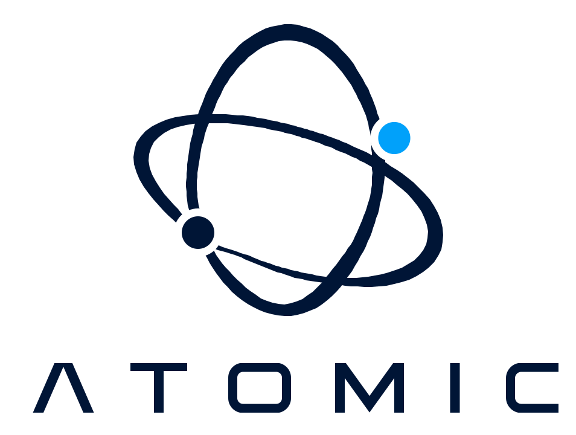
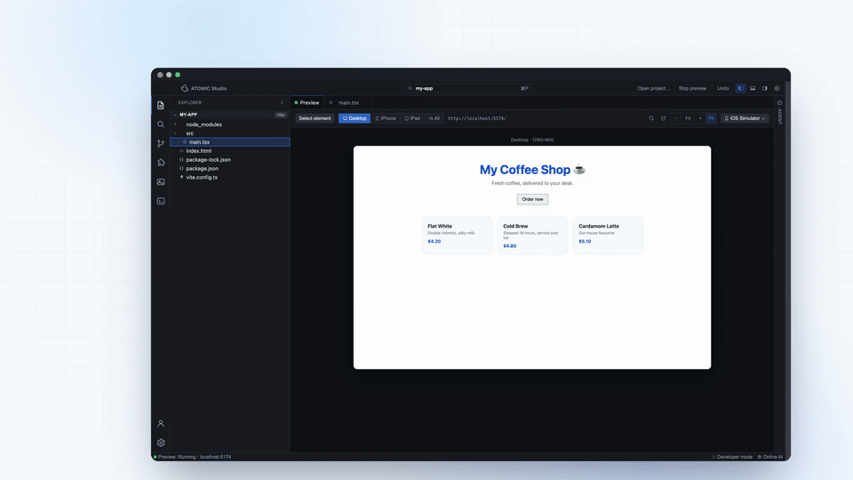
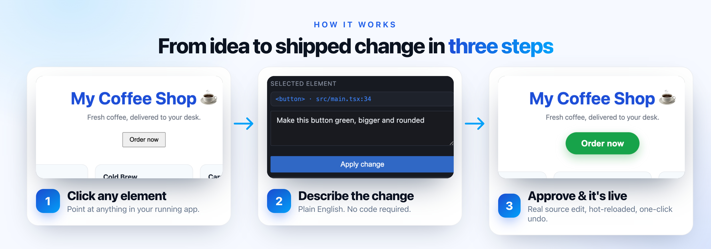
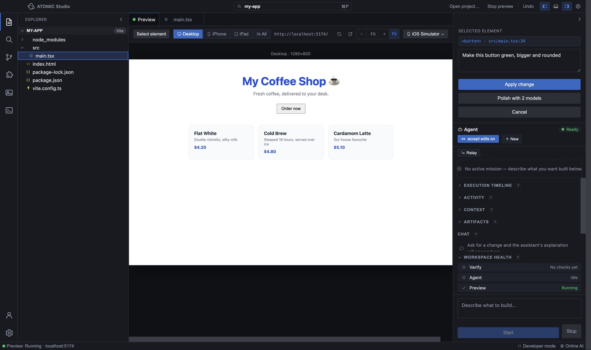
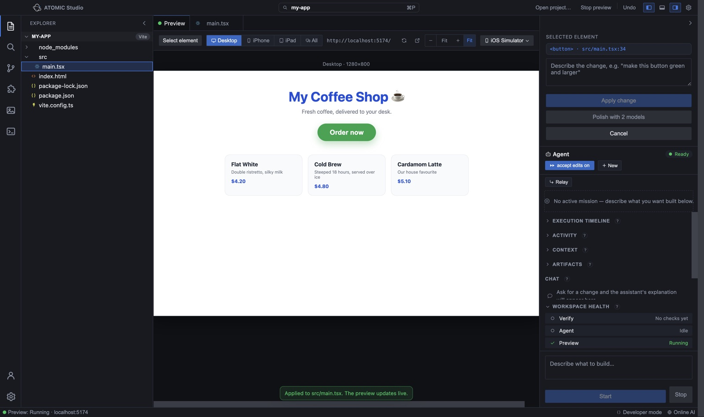
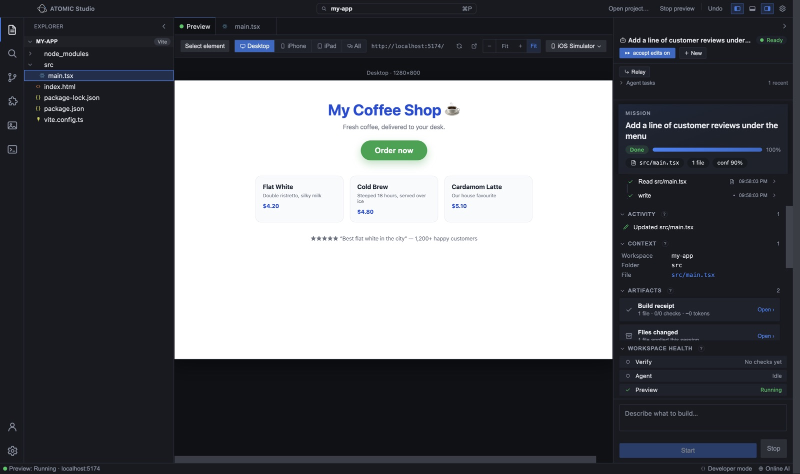
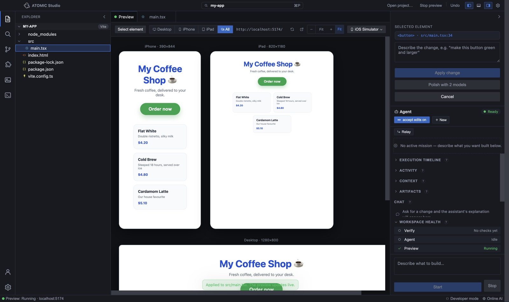
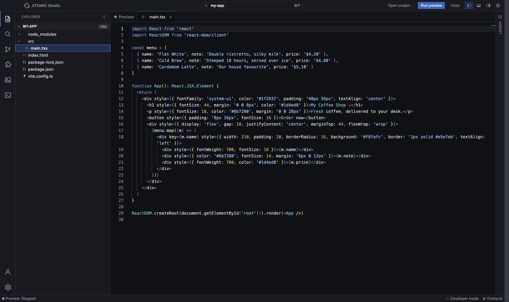
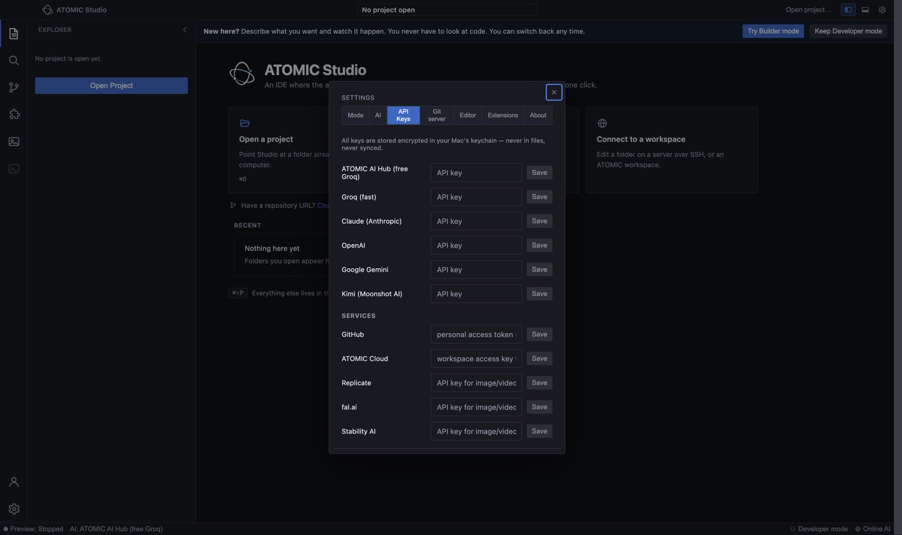
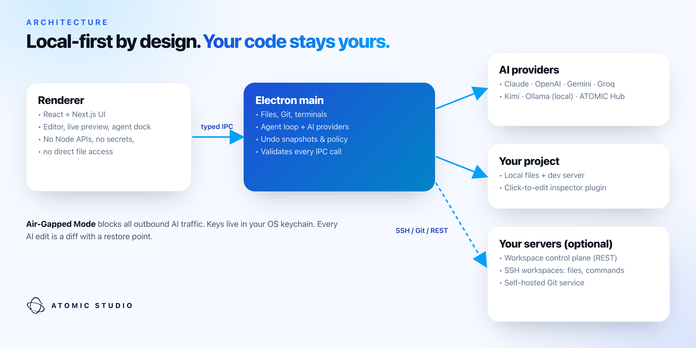

<div align="center">

<picture>
  <source media="(prefers-color-scheme: dark)" srcset="docs/brand/atomic-logo-dark.svg">
  
</picture>

# ATOMIC Studio

**The AI-native development environment for non-coders and pros.**<br>
Click any element in your live app, describe the change in plain English, approve the diff.

[](LICENSE)
[](CONTRIBUTING.md)
[](https://github.com/ATOMIC-For-information-technology/ATOMICStudio/labels/good%20first%20issue)
[](https://github.com/ATOMIC-For-information-technology/ATOMICStudio/discussions)
[](https://github.com/ATOMIC-For-information-technology/ATOMICStudio/stargazers)

[**Quick start**](#-quick-start) · [**Contribute**](#-contributing) · [**Roadmap**](ROADMAP.md)

<br>



</div>

<br>

## ✨ Why ATOMIC Studio

Most AI coding tools start from the code. ATOMIC Studio starts from **the thing you can see**: your running app.

| | |
|---|---|
| 🎯 **Click-to-edit live preview** | Click any element in your running app (React, Next.js, Vue, Svelte, plain HTML), describe the change, and the AI edits the exact source line. |
| 🛡️ **Trust by default** | Every AI change is a reviewable diff with a confidence score and a build receipt. Plan mode is read-only. One click undoes anything. |
| 🩹 **Self-healing preview** | Runtime errors are captured and repaired automatically — non-coders never see a stack trace. |
| 🔑 **Your model, your keys** | Claude, OpenAI, Gemini, Groq, Kimi, Ollama (fully local) or the free ATOMIC Hub. Keys stay in your OS keychain. |
| 🖥️ **Your servers** | Turn any SSH box (AWS, Hetzner, office server) into a workspace. Your code never has to leave your infrastructure. |
| 💬 **Plain English everywhere** | Explain any project, any terminal error, any Git diff. |

<br>

<p align="center"></p>

## 📸 A closer look

<table>
  <tr>
    <td width="50%"><br><b>Click-to-edit.</b> Select anything in the live preview — Studio finds the component and line for you.</td>
    <td width="50%"><br><b>Instant, real edits.</b> The source file changes and the preview hot-reloads. One click to undo.</td>
  </tr>
  <tr>
    <td><br><b>An agent that shows its work.</b> Reads before it writes, logs every step, scores its confidence.</td>
    <td><br><b>Every screen at once.</b> iPhone, iPad and desktop previews side by side — plus the real iOS Simulator.</td>
  </tr>
  <tr>
    <td><br><b>A real editor when you want it.</b> Monaco (the VS Code engine), bundled fully offline.</td>
    <td><br><b>Bring any model.</b> Paste a key once — or run offline with Ollama in Air-Gapped Mode.</td>
  </tr>
</table>

## 🚀 Quick start

Requirements: **Node.js 20+** on macOS, Windows or Linux.

```bash
git clone https://github.com/ATOMIC-For-information-technology/ATOMICStudio.git
cd ATOMICStudio
npm install
npm run dev
```

Open one of the sample projects in `examples/` and press **Run preview** — then click something.<br>
Build a desktop app with `npm run build` (packaged by electron-builder in `apps/desktop`).

> **No API key?** Pick **ATOMIC Hub (free)** in Settings → AI, or run a local model with Ollama.

## 🏗️ Architecture

<p align="center"></p>

| Path | What's inside |
|---|---|
| [`apps/desktop`](apps/desktop) | The Electron + Next.js desktop app — editor, live preview, AI agent |
| [`packages/inspector-plugin`](packages/inspector-plugin) | The click-to-edit inspector injected into live previews |
| [`server`](server) | Self-hosted workspace control plane + Git service |
| [`examples`](examples) | Sample projects used by the tests and demos |
| [`docs`](docs) | Architecture guides — start at [`docs/README.md`](docs/README.md) |

## 🤝 Contributing

ATOMIC Studio is built in the open and **we'd love your help** — you don't need to be an expert.

**Great places to start**

- 🟢 Pick a [**good first issue**](https://github.com/ATOMIC-For-information-technology/ATOMICStudio/labels/good%20first%20issue)
- 🧩 Extend click-to-edit to a new framework (Angular, Solid, Astro…)
- 🪟🐧 Try Studio on **Windows or Linux** and report what breaks
- 🌍 Translate the interface (Arabic, French, Spanish, …)
- 📚 Improve docs, add an example project, record a tutorial

**How it works:** fork → branch → `npm run typecheck` + the tests in [CONTRIBUTING.md](CONTRIBUTING.md) → open a pull request. Every PR gets a review from the core team.

Questions or ideas? Start a thread in [**Discussions**](https://github.com/ATOMIC-For-information-technology/ATOMICStudio/discussions).

<a href="https://github.com/ATOMIC-For-information-technology/ATOMICStudio/graphs/contributors"></a>

## 🔒 Security

Please don't report security issues in public issues — email **security@atomic.limited** instead. See [SECURITY.md](SECURITY.md).

## 📄 License

[Apache License 2.0](LICENSE) © 2026 ATOMIC Limited. "ATOMIC" and "ATOMIC Studio" are trademarks of ATOMIC Limited.

<div align="center"><br>
<picture>
  <source media="(prefers-color-scheme: dark)" srcset="docs/brand/atomic-mark-dark.svg">
  
</picture>
<br><sub>If ATOMIC Studio helps you, <b>give it a ⭐</b> — it helps other developers find it.</sub>
</div>
