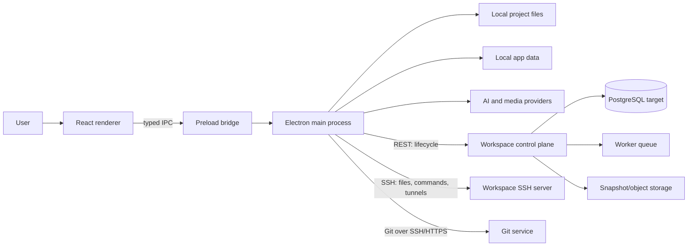

# ATOMIC Studio System Architecture

## Purpose and scope

ATOMIC Studio is a local-first, AI-native Electron IDE with a statically exported Next.js renderer. It edits local projects directly and can connect to company-hosted or ATOMIC-hosted workspaces. This design covers the desktop frontend, privileged local backend, remote workspace control plane, Git service, persistence, AI providers, and operational concerns.

## Architectural context

The shipped reference server stores metadata on disk. PostgreSQL, workers, and object storage are the target production shape, described in [database-schema.md](database-schema.md).

## Core boundaries

| Boundary | Responsibility | Must not own |
|---|---|---|
| Renderer | Views, interaction, ephemeral UI state | Node APIs, secrets, direct filesystem access |
| Preload | Narrow typed `StudioApi` bridge | Business logic or persistence |
| Electron main | Files, Git, terminals, agent loop, providers, policy | React presentation state |
| Control plane | Identity, teams, workspace lifecycle, billing metadata | Editing file contents |
| SSH/Git data planes | Remote files, commands, repository transport | Subscription or UI logic |
| Workers | Provisioning, snapshots, cleanup, webhooks | Synchronous request rendering |

## Primary data flows

### Local AI edit

1. Renderer submits an instruction through typed IPC.
2. Main loads relevant code index and project memory.
3. The agent reads before editing and applies policy gates.
4. Build mode creates a restore point, writes through `fs-service`, and verifies; Plan mode returns a proposal only.
5. Main emits progress and a build receipt to the renderer.

### Remote workspace open

1. Main calls the control plane to start or inspect a workspace.
2. The control plane returns SSH coordinates, never project contents.
3. Main connects through `remote.ts`; policy, audit, and command guards remain identical across company and cloud workspaces.
4. Preview traffic uses an SSH tunnel rather than a public development port.

## Non-functional targets

- Desktop startup usable within 3 seconds on a warm machine.
- IPC interactions under 100 ms unless explicitly asynchronous.
- Control-plane availability target: 99.9%; workspace editing continues during brief control-plane outages when SSH is already established.
- No plaintext secret persistence. Encrypt local secrets with OS facilities and use a managed secret store server-side.
- Every mutation has an actor, request ID, audit event, and idempotency strategy.

## Security model

Treat renderer, project files, extension manifests, model output, and remote responses as untrusted. Validate IPC arguments in main, resolve project-relative paths against an approved root, restrict commands, and keep `contextIsolation: true` with `nodeIntegration: false`. Connector tools require per-tool approval. Air-Gapped Mode blocks outbound AI and MCP traffic. Server authorization is role- and repository-scoped; deletions use recoverable trash or retention windows.

## Growth path and trade-offs

The local-first split improves privacy and offline use but duplicates some indexing and state across devices. Keep local JSON/JSONL for single-device data until transactional querying or sync is required. Move shared identity, teams, workspaces, repositories, audit metadata, and billing state to PostgreSQL. Add a durable queue before provisioning spans multiple hosts. Revisit service extraction only when deployment or scaling pressure appears; a modular control-plane service is simpler than premature microservices.
