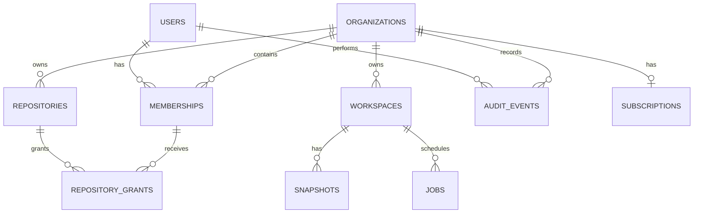

# Database and Persistence Design

## Current persistence

The desktop currently uses local files under Electron `userData`: JSON registries for workspaces, connectors, mode, themes, and policies; JSONL for memory, decisions, ledger, analytics, and audit; cached project indexes; and OS-encrypted key material. The reference server uses `meta/*.json`, `members.json`, snapshot archives, bare Git repositories, and JSONL audit logs. These stores are appropriate for local-first use and a single reference node, but they are not a shared transactional database.

## Target storage choices

- **PostgreSQL:** identities, organizations, memberships, workspaces, repositories, jobs, audit metadata, and subscriptions.
- **Object storage:** compressed workspace snapshots and large build artifacts.
- **Workspace volumes:** checked-out source and runtime files.
- **Secret manager:** provider tokens, workspace credentials, signing keys. Database rows store references only.
- **Desktop local files:** private project memory, preferences, indexes, and offline state unless users explicitly enable sync.

## Entity relationships

## PostgreSQL schema

Use UUID primary keys, `timestamptz`, lowercase enum/check values, and `jsonb` only for bounded metadata—not core relationships.

| Table | Important columns |
|---|---|
| `users` | `id`, `external_subject` unique, `email`, `display_name`, `created_at`, `disabled_at` |
| `organizations` | `id`, `slug` unique, `name`, `created_at` |
| `memberships` | `id`, `organization_id`, `user_id`, `role`, `created_at`, `revoked_at`; unique active org/user pair |
| `workspaces` | `id`, `organization_id`, `name`, `kind`, `state`, `host_id`, `root_path`, `template`, `policy_json`, `created_by`, `created_at`, `last_seen_at`, `deleted_at`, `version` |
| `repositories` | `id`, `organization_id`, `name`, `storage_path`, `default_branch`, `created_by`, `created_at`, `deleted_at` |
| `repository_grants` | `repository_id`, `membership_id`, `access`; composite primary key |
| `ssh_keys` | `id`, `membership_id`, `fingerprint` unique, `public_key`, `created_at`, `revoked_at` |
| `snapshots` | `id`, `workspace_id`, `name`, `description`, `object_key`, `byte_size`, `checksum`, `state`, `created_by`, `created_at`, `expires_at` |
| `jobs` | `id`, `type`, `resource_type`, `resource_id`, `state`, `payload_json`, `attempts`, `run_after`, `locked_at`, `last_error`, timestamps |
| `audit_events` | `id` bigserial, `organization_id`, `actor_user_id`, `event`, `resource_type`, `resource_id`, `request_id`, `detail_json`, `ip_hash`, `created_at` |
| `subscriptions` | `organization_id` PK, `provider_customer_ref`, `plan`, `status`, `period_end`, `updated_at` |

Roles should use `admin`, `manager`, `lead`, and `dev`, matching `src/shared/roles.ts`. Repository access uses `read`, `write`, or `admin`. Workspace states should include `provisioning`, `ready`, `suspended`, `error`, `deleting`, and `deleted`.

## Indexes and integrity

- Unique partial index on active memberships: `(organization_id, user_id) WHERE revoked_at IS NULL`.
- Workspace list index: `(organization_id, deleted_at, last_seen_at DESC)`.
- Job-claim index: `(state, run_after)` where state is `queued`.
- Audit lookup indexes on `(organization_id, created_at DESC)` and `(resource_type, resource_id, created_at DESC)`.
- Foreign keys use `RESTRICT` for organizations and repositories; deletion is soft first, followed by audited retention cleanup.
- Use optimistic concurrency through `workspaces.version` to prevent lost lifecycle updates.

## Retention and migration

Audit events are append-only and retained according to organization policy. Snapshot objects expire through `expires_at`; database metadata is removed only after object deletion succeeds. Never store raw access tokens, private SSH keys, source files, prompts, or generated code in PostgreSQL.

Migrate incrementally: introduce PostgreSQL behind the existing `/v1` contracts, dual-write server metadata during a short validation period, backfill `members.json` and `meta/*.json`, compare reads, switch authority to PostgreSQL, then retain read-only exports for rollback. Desktop local stores should remain local until a separately designed opt-in synchronization feature exists.
