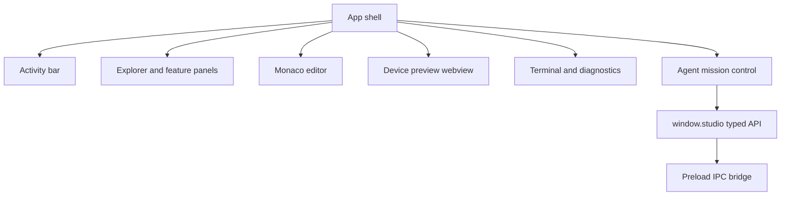

# Frontend Architecture

## Runtime model

The frontend is a Next.js App Router application in `apps/desktop/src/renderer`, statically exported for Electron. Next provides the React build and client composition; Electron remains the application host and backend. The renderer runs with no Node integration. `src/preload/index.ts` exposes the typed `StudioApi`; `src/preload/preview.ts` is a separate, sandboxed, import-free bridge for project previews.

## Composition rules

- Keep `App.tsx` as orchestration, not a destination for feature logic.
- Keep Electron-dependent surfaces client-only. `app/desktop-shell.tsx` disables server rendering for the workbench because it reads `window.studio` and local storage.
- Place substantial surfaces in `components/<feature>/` with a barrel `index.ts`.
- Put pure event-to-view transformations in `derive.ts`; reusable behavior belongs in hooks.
- Use shared domain types from `src/shared`, never duplicate backend response shapes.
- Use CSS custom properties from `styles.css` and the tokens documented in `DESIGN.md`.

## State ownership

Use component state for transient interaction, such as an open menu. Keep window-scoped project, preview, and selection state in the renderer but treat main as authoritative for files, mode, policies, workspace state, and long-running jobs. Subscribe to main-process events and always return/unregister cleanup functions. Do not introduce a global state library until cross-feature state produces measurable coordination problems.

## IPC contract

Adding a request requires coordinated changes to:

1. `src/shared/ipc.ts` — channel identifier.
2. `src/shared/types.ts` — `StudioApi` request and response types.
3. `src/main/index.ts` — validated handler.
4. `src/preload/index.ts` — typed invocation.

Handlers should return discriminated results such as `{ ok: true, value } | { ok: false, error }`. Renderer copy should translate technical failures into actionable language while diagnostics retain the underlying detail.

## Accessibility and performance

All controls must be keyboard reachable, visibly focused, and correctly labelled. Modals require focus containment and restoration; expandable regions expose `aria-expanded`; motion respects `prefers-reduced-motion`. Virtualize only measured large lists. Debounce expensive indexing/search requests and avoid sending large file bodies repeatedly over IPC.

## Verification

Run TypeScript checks and the Electron UI suite. UI changes should be inspected in Builder and Developer modes, across light/dark themes, narrow layouts, keyboard-only navigation, and the sample projects in `examples/`.

`npm run dev` starts the Next development server and Electron together. `npm run build` builds main/preload code, runs the Next static export, and copies it to `out/renderer`, which is the location loaded and packaged by Electron. Do not introduce Next server actions, API routes, middleware, or runtime image optimization: the packaged renderer has no Next server.
